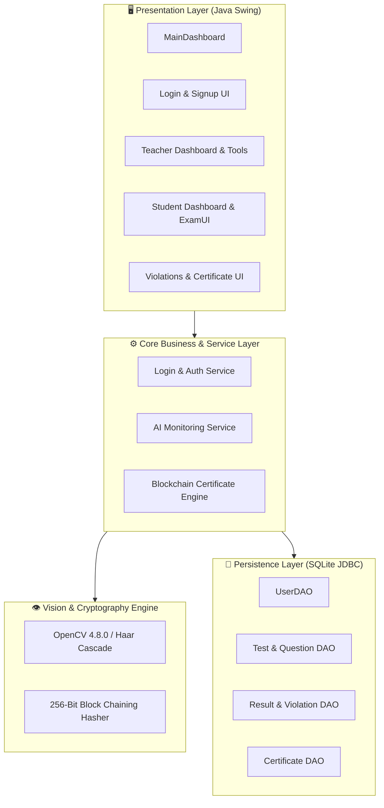
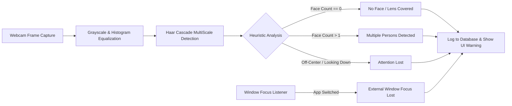

<div align="center">

# 🎓 SmartExam System
### *AI-Proctored Online Examination & Blockchain Certificate Verification Platform*

[](https://www.oracle.com/java/)
[](https://opencv.org/)
[](https://www.sqlite.org/)
[](https://docs.oracle.com/javase/tutorial/uiswing/)
[](LICENSE)

<p align="center">
  <b>SmartExam</b> is a robust, desktop-based examination platform engineered in Java. It combines real-time <b>Computer Vision (AI Proctoring)</b> to prevent academic dishonesty and <b>Cryptographic Blockchain Hashing</b> to issue tamper-proof digital certificates.
</p>

[Key Features](#-key-features) • [Architecture](#-architecture--system-design) • [AI Proctoring Engine](#-ai-proctoring-engine) • [Blockchain Certificates](#-tamper-proof-blockchain-certificates) • [Quick Start](#-installation--getting-started) • [Tech Stack](#-technology-stack)

---

</div>

## 📌 Table of Contents
- [Overview](#-overview)
- [Key Features](#-key-features)
- [Architecture & System Design](#-architecture--system-design)
- [AI Proctoring Engine](#-ai-proctoring-engine)
- [Tamper-Proof Blockchain Certificates](#-tamper-proof-blockchain-certificates)
- [Database Schema](#-database-schema)
- [Technology Stack](#-technology-stack)
- [Installation & Getting Started](#-installation--getting-started)
- [Default Demo Credentials](#-default-demo-credentials)
- [Project Structure](#-project-structure)
- [Future Roadmap](#-future-roadmap)
- [Author & Acknowledgments](#-author--acknowledgments)

---

## 📖 Overview

In modern remote and digital education environments, ensuring academic integrity and issuing verifiable credentials are two major challenges. **SmartExam** solves both problems natively:
1. **Automated Proctoring**: Employs real-time computer vision (OpenCV) algorithms to monitor examinee behavior (multiple faces, attention drift, camera blockage, and window switching).
2. **Immutable Credentials**: Issues cryptographic, chained digital certificates that can be independently verified without contacting a central authority or database administrator.

---

## ✨ Key Features

### 👨‍🏫 Teacher Portal
- **Test Authoring Studio**: Create custom tests with MCQ questions, multiple choice options (A/B/C/D), and defined answer keys.
- **Dynamic Student Assignment**: Assign specific exams to individual students or batches.
- **Analytics & Gradebook**: View real-time student scores, attempt dates, and submission history.
- **Security Incident Hub**: Comprehensive violations dashboard with filtering by student, exam, and violation type.
- **Public Certificate Verifier**: Inspect and authenticate any certificate ID.

### 👨‍🎓 Student Portal
- **Test Dashboard**: Access all active, assigned examinations (enforces a strict one-attempt policy).
- **Pre-Exam Camera Check**: Automated biometric validation gate before unlocking test questions.
- **Timed Exam Environment**: Clean exam interface with dynamic countdown timers.
- **Instant Results & Certificates**: Immediate score calculation upon submission alongside cryptographic certificate generation.
- **Certificate Vault**: View, export, and verify all earned certificates in one place.

---

## 🏗 Architecture & System Design

SmartExam adheres to a clean, decoupled **Layered Architecture** leveraging the Data Access Object (DAO) pattern:



---

## 👁️ AI Proctoring Engine

The built-in proctoring engine operates as an autonomous background daemon thread during the examination session, evaluating live camera frames and window state:



### Monitored Violations

| Violation Code | Trigger Condition | Consequence |
|:---|:---|:---|
| `NO_FACE_DETECTED` | Student leaves camera view for ≥ 2 consecutive checks | Warning popup + Timestamped database incident log |
| `CAMERA_OBSTRUCTED` | Frame average brightness drops below threshold (black/covered) | Warning popup + Obstruction flag logged |
| `MULTIPLE_FACES` | ≥ 2 faces detected simultaneously in the frame | Anti-cheating warning + Multiple face violation logged |
| `ATTENTION_LOST` | Head center shifts >40% horizontally or >90% vertically | Visual reminder to face the screen + Logged |
| `FOCUS_LOST` | Student switches to a browser, notes, or external desktop application | Immediate security alert + Window switch logged |

---

## ⛓️ Tamper-Proof Blockchain Certificates

To prevent grade fabrication and certificate forgery, SmartExam models a lightweight **cryptographic hash chain**:

```
[Genesis Block] ──► [Certificate Block #1] ──► [Certificate Block #2] ──► [Certificate Block #N]
     ▲                       ▲                           ▲
     │                       │                           │
prev_hash: GENESIS      prev_hash: Block#1          prev_hash: Block#2
block_hash: H(data1)    block_hash: H(prev+data2)   block_hash: H(prev+dataN)
```

1. **Canonical Data Payload**:
   ```
   studentId | studentName | testId | testName | score | totalQuestions | timestamp | resultId
   ```
2. **Cryptographic Linking**:
   $$\text{Block Hash} = \text{Digest256}(\text{Previous Block Hash} \parallel \text{Canonical Payload})$$
3. **Verification**: Any student, university, or third-party employer can paste the Certificate ID into the built-in verifier to confirm:
   - ✅ **Content Integrity**: Recalculated hash matches stored `block_hash`.
   - ✅ **Chain Linkage**: `prev_hash` anchors back to an existing block in the chain.

---

## 💾 Database Schema

The database uses an embedded SQLite database (`smartexam.db`) with 7 interconnected tables:

```
┌──────────────┐       ┌──────────────┐       ┌──────────────┐
│    users     │       │    tests     │       │  questions   │
├──────────────┤       ├──────────────┤       ├──────────────┤
│ id (PK)      │───┐   │ id (PK)      │───┐   │ id (PK)      │
│ username     │   │   │ test_name    │   └──►│ test_id (FK) │
│ password     │   └──►│ created_by   │       │ question     │
│ role         │       └──────────────┘       │ options A-D  │
└──────────────┘              │               │ correct_opt  │
       │                      │               └──────────────┘
       │                      ▼
       │               ┌───────────────────┐
       │               │ test_assignments  │
       │               ├───────────────────┤
       │               │ test_id (FK)      │
       │               │ student_id (FK)   │
       │               └───────────────────┘
       ▼
┌──────────────────┐   ┌──────────────────┐   ┌──────────────────┐
│     results      │   │   certificates   │   │    violations    │
├──────────────────┤   ├──────────────────┤   ├──────────────────┤
│ id (PK)          │   │ certificate_id   │   │ id (PK)          │
│ student_id (FK)  │   │ student_id (FK)  │   │ student_id (FK)  │
│ test_id (FK)     │   │ test_id (FK)     │   │ test_id (FK)     │
│ score, timestamp │   │ score, hashes    │   │ violation_type   │
└──────────────────┘   └──────────────────┘   │ details, time    │
                                              └──────────────────┘
```

---

## 💻 Technology Stack

* **Core Engine:** Java 17+ (OOP, Multithreading, Daemons, Event Dispatch Thread)
* **GUI / Presentation:** Java Swing (AWT, Window Listeners, GridBag/Border Layouts)
* **Computer Vision:** OpenCV 4.8.0 Java API + Haar Cascade XML Classifier
* **Database & Persistence:** SQLite 3 + JDBC Driver 3.51.2
* **Security & Hashes:** MD5 (Passwords) + 256-Bit Block Chaining Digest (Certificates)
* **Build System:** Native shell tooling (`compile.sh`, `run.sh`)

---

## 🚀 Installation & Getting Started

### Prerequisites
* **Java Development Kit (JDK 17 or higher)** installed:
  ```bash
  java -version
  ```
* **macOS / Linux / Windows** with a working webcam.
* *(macOS Users)* If using external OpenCV:
  ```bash
  brew install opencv
  ```

### Step 1: Clone the Repository
```bash
git clone https://github.com/your-username/SmartExamSystem.git
cd SmartExamSystem
```

### Step 2: Compile the Project
```bash
chmod +x compile.sh run.sh
./compile.sh
```

### Step 3: Run the Application
```bash
./run.sh
```

---

## 🔑 Default Demo Credentials

On initial boot, the database automatically initializes with sample accounts:

| Role | Username | Password |
|:---|:---|:---|
| **👨‍🏫 Teacher** | `teacher` | `123` |
| **👨‍🎓 Student** | `student` | `123` |

*(You can also use the **Sign Up** interface to register new student or teacher accounts.)*

---

## 📂 Project Structure

```
SmartExamSystem/
├── compile.sh                      # Shell script for compilation
├── run.sh                          # Execution script with OpenCV native linkers
├── sources.txt                     # Source file manifest
├── resources/
│   └── haarcascade_frontalface_default.xml # Face detection model
├── lib/
│   ├── opencv-480.jar              # OpenCV Java API
│   ├── sqlite-jdbc-3.51.2.0.jar    # SQLite JDBC connector
│   └── *.dylib                     # Native OpenCV shared libraries
└── src/com/smartexam/
    ├── Main.java                   # Entry point
    ├── ai/                         # Computer vision & proctoring logic
    │   ├── CameraService.java
    │   ├── CheatingDetector.java
    │   ├── FaceVerifier.java
    │   └── MonitoringService.java
    ├── auth/                       # Authentication routines
    │   └── LoginService.java
    ├── blockchain/                 # Cryptographic certificate chain
    │   ├── CertificateChainService.java
    │   └── CustomChainHasher.java
    ├── db/                         # DAO pattern data layer
    │   ├── DBConnection.java
    │   ├── DBInitializer.java
    │   ├── UserDAO.java
    │   ├── TestDAO.java
    │   ├── QuestionDAO.java
    │   ├── AssignmentDAO.java
    │   ├── ResultDAO.java
    │   ├── CertificateDAO.java
    │   └── ViolationDAO.java
    ├── ui/                         # Swing interface views
    │   ├── MainDashboard.java
    │   ├── LoginUI.java
    │   ├── SignupUI.java
    │   ├── TeacherDashboard.java
    │   ├── StudentDashboard.java
    │   ├── ExamUI.java
    │   ├── CreateTestUI.java
    │   ├── AssignStudentsUI.java
    │   ├── ResultUI.java
    │   ├── CertificateVerifyUI.java
    │   ├── CertificateViewHelper.java
    │   └── ViolationsReportUI.java
    └── util/                       # Utilities
        └── HashUtil.java
```

---

## 🔮 Future Roadmap

- [ ] **Adaptive Password Security**: Migration from MD5 to salted `bcrypt`/`Argon2`.
- [ ] **Configurable Exam Timers**: Per-test duration and question-level timing rules.
- [ ] **Question Shuffling & Pools**: Randomized question order per candidate.
- [ ] **PDF Export**: Generate downloadable, styled PDF certificates with embedded QR codes.
- [ ] **Web / Cloud Client**: REST API backend integration for cross-device web browser testing.

---

## 👤 Author & Acknowledgments

* **Developer:** [Naitik Dhiman](https://github.com/naitikdhiman), Krish Gupta, Sneha Negi, Vanshika Bhatt
* **Course:** Java Project-Based Learning (Semester IV)
* **Special Thanks:** Open source contributors to the OpenCV and SQLite-JDBC projects.

---
<div align="center">
  ⭐ <i>Star this repository if you found this project helpful or inspiring!</i> ⭐
</div>
